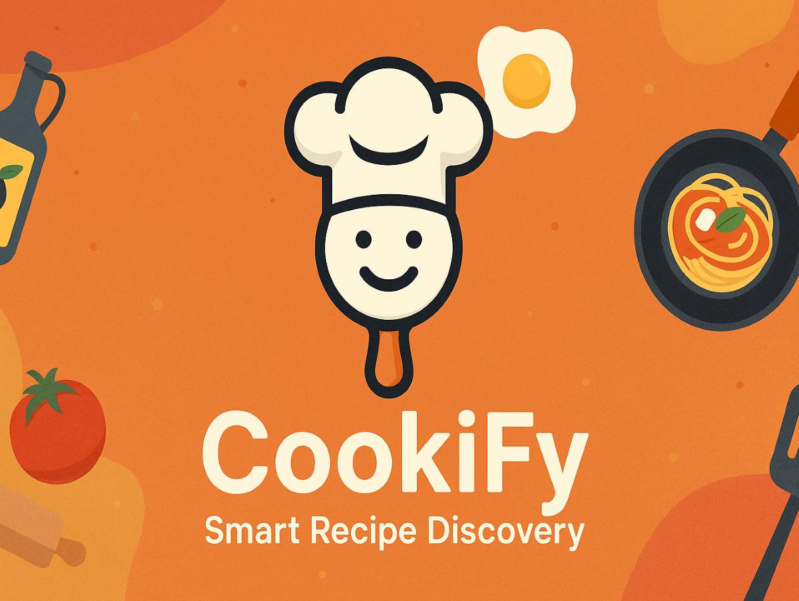

<div align="center">
  <div align="center">
  <!-- Uncomment when banner is ready: -->
  

  <!-- Stylized CookiFy Logo -->
  


  <!-- Subtitle with Chef Emojis -->
  <h1>
    
    Smart Recipe Discovery & AI-Powered Cooking
    
  </h1>
</div>

  [](https://opensource.org/licenses/MIT)
  [](https://reactjs.org/)
  [](https://www.typescriptlang.org/)
  [](https://vitejs.dev/)

  [](https://tailwindcss.com/)
  [](https://appwrite.io/)
  [](https://ai.google.dev/)
  [](https://developer.mozilla.org/en-US/docs/Web/API/Web_Speech_API)
</div>


<p align="center">
  🍳 <b>Welcome to CookiFy!</b> Transform your everyday ingredients into extraordinary meals with our AI-powered recipe generation platform. Whether you're a novice cook or a culinary enthusiast, our intelligent system creates personalized recipes, provides step-by-step cooking guidance, and helps you reinvent your favorite dishes! Plus, enjoy voice-controlled features and smart cooking timers! 🤖👨‍🍳✨
</p>

<p align="center">
  <a href="#-overview">Overview</a> •
  <a href="#-key-features">Key Features</a> •   
  <a href="#-tech-stack">Tech Stack</a> •
  <a href="#-getting-started">Getting Started</a> •
  <a href="#-folder-structure">Folder Structure</a> •
  <a href="#-contributing">Contributing</a> •
  <a href="#-showcase">Showcase</a> •
  <a href="#-faqs">FAQs</a> •
  <a href="#-license">License</a>
</p>

---
##  Overview

CookiFy is an intelligent culinary companion that revolutionizes the way you approach cooking. Using advanced AI technology powered by Google's Gemini model, our platform transforms your available ingredients into creative, personalized recipes tailored to your dietary preferences, cooking style, and taste profile.

Beyond recipe generation, CookiFy offers a comprehensive cooking experience with features like recipe reinvention, smart cooking schedules, voice-controlled assistance, and a sophisticated favorites management system. Whether you're looking to use up leftover ingredients, explore new cuisines, or perfect your cooking techniques, CookiFy adapts to your culinary journey.

With a focus on accessibility and user experience, CookiFy empowers home cooks of all skill levels to create delicious meals, reduce food waste, and discover new flavors in an intuitive, AI-enhanced environment.

---

##  Key Features

<table>
  <tr>
    <td>
      <h3>🤖 AI Recipe Generation</h3>
      Transform any combination of ingredients into creative, personalized recipes using Google's Gemini AI technology.
    </td>
    <td>
      <h3>🍽️ Smart Recipe Reinvention</h3>
      Reimagine your favorite recipes with different cooking styles, dietary adaptations, and flavor profiles.
    </td>
  </tr>
  <tr>
    <td>
      <h3>📱 Voice Control Integration</h3>
      Hands-free cooking experience with voice commands for recipe reading and step-by-step guidance.
    </td>
    <td>
      <h3>⏰ Smart Cooking Scheduler</h3>
      AI-generated cooking timelines with synchronized steps and intelligent time management.
    </td>
  </tr>
  <tr>
    <td>
      <h3>📷 Dynamic Recipe Images</h3>
      AI-generated food photography for every recipe with regeneration capabilities for fresh visuals.
    </td>
    <td>
      <h3>🎯 Personalized Preferences</h3>
      Customize recipes based on dietary restrictions, chef personalities, and flavor preferences.
    </td>
  </tr>
  <tr>
    <td>
      <h3>💾 Smart Favorites System</h3>
      Save, organize, and manage your favorite recipes with cloud synchronization via Appwrite.
    </td>
    <td>
      <h3>🔄 Recipe Sharing</h3>
      Share your culinary creations with friends and family through multiple export formats.
    </td>
  </tr>
  <tr>
    <td>
      <h3>🎨 Responsive Design</h3>
      Beautiful, mobile-first interface optimized for both desktop and mobile cooking experiences.
    </td>
    <td>
      <h3>🔐 Secure Authentication</h3>
      User accounts and data protection powered by Appwrite's secure authentication system.
    </td>
  </tr>
</table>

---
##  Tech Stack

* **Framework:** [React 19](https://reactjs.org/) 
* **Build Tool:** [Vite](https://vitejs.dev/) 
* **Language:** [TypeScript](https://www.typescriptlang.org/) 
* **Styling:** [Tailwind CSS](https://tailwindcss.com/) 
* **Backend & Auth:** [Appwrite](https://appwrite.io/) 
* **AI Engine:** [Google Gemini](https://ai.google.dev/) 
* **Voice Features:** [Web Speech API](https://developer.mozilla.org/en-US/docs/Web/API/Web_Speech_API) 
* **Routing:** [React Router](https://reactrouter.com/) 
* **Image Processing:** [html2canvas](https://html2canvas.hertzen.com/) 

---

##  Getting Started

Follow these steps to set up and run CookiFy locally:

1.  **Clone the repository:**
    ```bash
    git clone https://github.com/Sushmit-Biswas/Zense-CookiFy.git
    cd Zense-CookiFy
    ```

2.  **Install dependencies:**
    ```bash
    npm install
    # or
    yarn install
    # or
    pnpm install
    ```

3.  **Set up Environment Variables:**
    Create a `.env.local` file in the root directory and add the necessary environment variables:
    ```plaintext
    # Google Gemini AI Configuration
    GEMINI_API_KEY=your_gemini_api_key_here
    
    # Appwrite Configuration
    VITE_APPWRITE_ENDPOINT=https://cloud.appwrite.io/v1
    VITE_APPWRITE_PROJECT_ID=your_project_id_here
    VITE_APPWRITE_DATABASE_ID=your_database_id_here
    VITE_APPWRITE_USER_COLLECTION_ID=your_user_collection_id_here
    VITE_APPWRITE_RECIPE_COLLECTION_ID=your_recipe_collection_id_here
    ```

4.  **Set up Appwrite:**
    - Create an account at [Appwrite Cloud](https://cloud.appwrite.io/)
    - Create a new project and configure your database collections
    - Update the environment variables with your Appwrite project details

5.  **Get Google Gemini API Key:**
    - Visit [Google AI Studio](https://ai.google.dev/)
    - Generate your API key and add it to your environment variables

6.  **Run the development server:**
    ```bash
    npm run dev
    # or
    yarn dev
    # or
    pnpm dev
    ```

7.  Open [http://localhost:5173](http://localhost:5173) in your browser to experience CookiFy! 

---

##  Folder Structure

```
cookify/
├── public/                    # Static assets
│   └── images/               # Image assets (logos, banners)
├── src/                      # Source code
│   ├── components/           # React components
│   │   ├── auth/            # Authentication components
│   │   │   ├── Login.tsx
│   │   │   └── Signup.tsx
│   │   ├── pages/           # Page components
│   │   │   ├── HomePage.tsx
│   │   │   ├── FavoritesPage.tsx
│   │   │   ├── ReinventionPage.tsx
│   │   │   └── CookingPath.tsx
│   │   └── ui/              # Reusable UI components
│   │       ├── Header.tsx
│   │       ├── RecipeCard.tsx
│   │       ├── VoiceControl.tsx
│   │       └── Icons.tsx
│   ├── contexts/            # React contexts
│   │   ├── AuthContext.tsx
│   │   └── NotificationContext.tsx
│   ├── hooks/               # Custom React hooks
│   │   ├── useFavorites.ts
│   │   ├── useRecipeShare.ts
│   │   └── useTextToSpeech.ts
│   ├── services/            # API and service integrations
│   │   ├── appwriteService.ts
│   │   ├── geminiService.ts
│   │   ├── nutritionService.ts
│   │   └── voiceService.ts
│   ├── utils/               # Utility functions and constants
│   │   ├── constants.ts
│   │   └── index.ts
│   ├── App.tsx              # Main app component
│   ├── index.tsx            # App entry point
│   ├── types.ts             # TypeScript type definitions
│   └── index.css            # Global styles
├── .env.local               # Environment variables (gitignored)
├── vite.config.ts           # Vite configuration
├── package.json             # Dependencies and scripts
└── tsconfig.json            # TypeScript configuration
```

---

##  Showcase

<div align="center">
  <h3>🏠 Smart Recipe Generation</h3>
  <p>Transform your ingredients into culinary masterpieces with AI-powered recipe creation</p>
  
  <h3>🔄 Recipe Reinvention</h3>
  <p>Reimagine your favorite dishes with different styles, cuisines, and dietary adaptations</p>
  
  <h3>📱 Voice-Controlled Cooking</h3>
  <p>Hands-free cooking experience with intelligent voice commands and audio guidance</p>
  
  <h3>⏰ Smart Cooking Schedules</h3>
  <p>AI-generated cooking timelines that optimize your kitchen workflow</p>
</div>

---

##  FAQs

<details>
  <summary><b>Is CookiFy free to use?</b></summary>
  <p>Yes, CookiFy is currently free for all users. Enjoy full access to AI recipe generation, voice features, and favorites management without any cost.</p>
</details>

<details>
  <summary><b>What types of ingredients can CookiFy work with?</b></summary>
  <p>CookiFy can work with virtually any ingredient! From common pantry staples to exotic spices, our AI understands thousands of ingredients and can create recipes regardless of what you have on hand.</p>
</details>

<details>
  <summary><b>How accurate are the AI-generated recipes?</b></summary>
  <p>Our recipes are powered by Google's Gemini AI, which has been trained on extensive culinary data. The recipes are nutritionally balanced, technically sound, and tested for feasibility, though we always recommend using your cooking judgment.</p>
</details>

<details>
  <summary><b>Can I use CookiFy offline?</b></summary>
  <p>CookiFy requires an internet connection for AI recipe generation and image creation. However, saved recipes can be viewed offline once they're loaded in your favorites.</p>
</details>

<details>
  <summary><b>Does CookiFy support dietary restrictions?</b></summary>
  <p>Absolutely! CookiFy supports various dietary preferences including vegetarian, vegan, gluten-free, keto, paleo, and many others. You can customize recipes based on your specific dietary needs.</p>
</details>

---

##  Contributing

Contributions are welcome! If you'd like to contribute to CookiFy, please follow these steps:

1.  Fork the repository
2.  Create a new branch (`git checkout -b feature/your-feature-name`)
3.  Make your changes
4.  Commit your changes (`git commit -m 'Add some amazing feature'`)
5.  Push to the branch (`git push origin feature/your-feature-name`)
6.  Open a Pull Request

Please ensure your code adheres to the project's coding standards and includes tests where applicable.

---

##   License

This project is licensed under the MIT License - see the [LICENSE](LICENSE) file for details.

---

##  Acknowledgements

* Powered by [Google Gemini AI](https://ai.google.dev/) for intelligent recipe generation
* Backend infrastructure provided by [Appwrite](https://appwrite.io/)
* Inspired by the passion for cooking and the desire to reduce food waste
* Special thanks to all beta testers and culinary enthusiasts who helped shape CookiFy


<div align="center">
  <p>Made with  and lots of   by <code>Sushmit Biswas</code></p>
  <p>
    <a href="https://github.com/Sushmit-Biswas">GitHub</a> •
    <a href="https://www.linkedin.com/in/sushmit-biswas">LinkedIn</a> •
    <a href="https://x.com/Sushmit__Biswas">X</a>
  </p>
  
  <h3>🍳 Happy Cooking with CookiFy! 🍳</h3>
</div>
